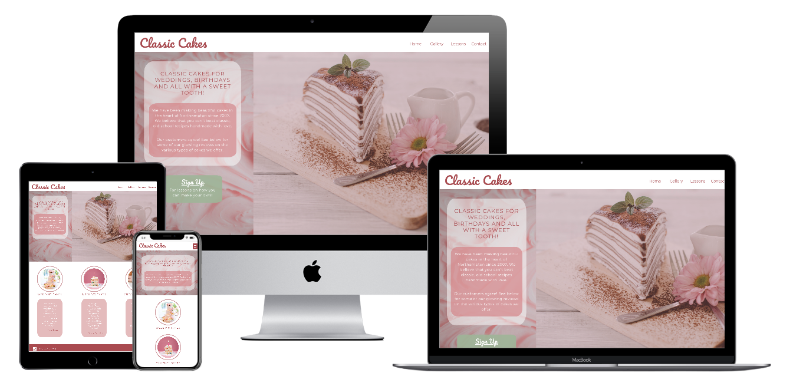
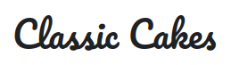
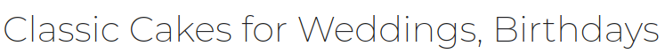

# Classic Cakes

## Overview

A website for a small local cake shop owner based in Northamptonshire.
The website features a home page with information about the shop and testimonials, a gallery of prior work, a page to enquire about baking lessons including a video example 
and a contact page with location details and a form for general enquiries.
For this website, the primary goal is to persuade potential customers to make contact with the shop via the lessons or contact page.

This website tries to allow the potential customer to find all the information that they need to make a decision to visit the shop by breaking the information into relevant 
pages and making it clear and easy to contact the shop in a number of ways.

## UX

### **Strategy**

The business goals of this website are:
* To build brand awareness of Classic Cakes.
* To provide high quality examples of the shop’s range and style
* To drive sales through; lesson enquiries which will lead to a booking call with the owner, contact page enquiries which would lead to customers visiting the shop to make a purchase or requesting a custom cake for a specific event.
* To provide distinguished UX to encourage potential clients to visit the store and to keep them using the site long enough to complete one of the forms.

The customer goals of this website are:
* To find delicious, beautiful cakes for events, a special treat or just to satisfy a sweet tooth.
* To easily find the types of cake on offer.
* To intuitively navigate to the lessons page and fill out the enquiry form to improve baking skills.
* To intuitively navigate to the contact page to find the store location.

Visitors to this website are searching for:
* A business to design and create a beautiful wedding cake for their special day.
* A birthday cake for a family member.
* Cupcake trays for special events or parties.
* Lessons to help improve their baking skills.

The ideal client for this business is:
* Living in Northamptonshire.
* Someone who regularly throws catered events.
* A cake lover.
* Engaged to be married.

This website is the best way to help them achieve these things because:
* Most local cake shop websites have extremely poor UX.
* Other local cake shop websites contain far too much content and therefore produce information overload quickly.
* This website is:
   * Intuitive and easy to navigate.
   * Able to guide the client through all the relevant information in a way that is easy to understand.
   * Able to guide them to the goal of the website - to fill out either the lessons or contact form.

#### Client stories

1. As a new visitor to the website, I want to easily navigate around the site to find what I’m looking for as quickly as possible.
2. As a new visitor to the website, I want to view a gallery of prior work to decide if I like the style for myself.
3. As a new visitor to the website, I want to see whether other customers have liked the cakes they purchased and the related service received.
4. As a new visitor to the website, I want to know what the baking lessons entail and what I can expect to pay.
5. As an interested client, I want to understand how to fill out the lessons form so that I can book in with the owner.
6. As an interested client, I want to understand how to fill out the contact form with as much detail as I want to give about my order.
7. As a returning visitor to the website, I want to easily navigate to the contact page to put details of a new request in.

### **Scope**

Based on the simple customer and business goals of Classic Cakes, the scope of the project and the features available needed to be fairly narrow so as not to overcomplicate and confuse the user.

#### Initial Feature Plan

These items must be completed for initial release:

* Gallery of **images** to convey the quality of work to the user.
* **Compelling copy** introducing the more novel idea of cake making lessons to the user.
* A contact form allowing the user to provide detailed descriptions of their request.

### **Structure**

Consistency, Predictability and Learnability:

This website will follow convention for its navigational elements. Predictably, these will be found at the top of the browser window on any screen size and will be consistent in their coloring and design.
Consistency will also be applied to headings and any other relevant information a user may need to understand quickly when visiting a page for the first time.
This will give the website a high learnability and will be largely intuitive for moving through the content even if they don't wish to follow the linear arrangement of the pages. 

Visibility:

The website will employ content hinting as part of its design on each page so as to encourage users to scroll to gain more detail, and more importantly for the business owner, complete a form.

Feedback:

Feedback will also be added to the website for links where possible as well as the submission button for the planned contact form. The form will also provide feedback should there be an error with any of the form entries.

### **Skeleton**

##### Wireframe mockups: 

Wireframes First Drafts:

* [Home](assets/images/readme-images/wireframe-draft-home.jpg)
* [Gallery](assets/images/readme-images/wireframe-draft-gallery.jpg)
* [Lessons](assets/images/readme-images/wireframe-draft-lessons.jpg)
* [Contact](assets/images/readme-images/wireframe-draft-contact.jpg)

Upon adding content to the website, it quickly became clear that the 1:1 ratio for the top of the majority of pages felt out of balance.
In order to fill the left hand side with enough information to not look empty, the website would have to sacrifice being succint and risk losing the user's interest.
To prevent this, the ratio was adapted to 1:2 which have the images and videos more impact and made the headings more punchy.

The gallery was also redesigned to remove the translucent colour cover, as once this was in place it was clear that it was obscuring the quality of the photos rather than adding a cohesiveness as was intended.

The map on the Contact page was changed to a hero image as the map colour scheme and aesthetic didn't flow with the rest of the website.

Both the hero video on the Lessons page and the map/hero image on the Contact page were changed to not display on mobiles to increase the visibility of the more important content and reduce data usage for mobile users.

Wireframes Final Versions:

* [Home](assets/images/readme-images/wireframe-final-home.jpg)
* [Gallery](assets/images/readme-images/wireframe-final-gallery.jpg)
* [Lessons](assets/images/readme-images/wireframe-final-lessons.jpg)
* [Contact](assets/images/readme-images/wireframe-final-contact.jpg)

#### Implemented Features
 
All the pages feature a typical **header** that users will be familiar with; a responsive **navigation bar** which includes the Classic Cakes **logo** in the top left and links to the website’s other pages in the top right. 
They all also feature a **footer** with **telephone contact information** as well as **social media icons** which link to Classic Cakes’ facebook and instagram pages.
 
Each page also includes **headings** relevant to the page on the left third below the header, and either a **hero image** or **hero video** on the right two thirds below the header. 
The purpose of both the headings and the images/video is to either verbally or visually reinforce the purpose of the page in an eye-catching way that will give a positive emotional response to the user.
 
##### Home:
 
The headings on the Home page contain some **compelling copy** which delivers the main message on the page and encourages the user to explore the page further. 
There is also a **call to action button** here guiding the user to visit the Lessons page.
 
The hero image on the Home page is visible on desktops and tablet devices, as at these larger screen sizes the user can absorb the information they convey. 
On smaller screen sizes, the hero image is not displayed as this gives a cleaner view of the headings and therefore the purpose of the page, and also reduces the mobile users’ data consumption.
 
The next section of the page details the types of product on offer, using interactive **photographs** as well as **testimonials** relating to the product they are paired with. 
On smaller screen sizes, the reviews are not displayed as this would hinder the user’s ability to quickly establish what Classic Cake’s main product offerings are.
 
##### Gallery:
 
The Gallery page contains 24 **thumbnail images** laid out at equal distance, the number on each row is adapted to the width of the screen.
Each thumbnail is circular, is in keeping with the images found on the Home page and features various types of cake on offer.
 
##### Lessons:
 
The headings on the lessons page also contain **compelling copy** and a **call to action** button only this time the button leads the user to the Contact page. 
On desktops and tablets there is then a **hero video** which autoplays on mute as a background element and reinforces the product offering visually. 
On mobiles, the hero video is not displayed as this gives a cleaner view of the headings and therefore the purpose of the page, and also reduces the mobile users’ data consumption.
 
There is then a detailed **description** of the product offering followed by a **pricing table**.
 
Finally, a **contact form** specifically for lesson enquiries which has boxes for name, email and phone number, the size of the group they wish to learn in, whether they want to learn online or in the Classic Cakes kitchen and any other information that may be relevant. 
At the end of the form there is a **Send Button** which triggers a **modal** to appear when clicked.
 
##### Contact:
 
The Contact page has similar features to the Home page; some headings which have **contact information** including street address, phone number and email address, and a hero image on larger screen sizes which does not display on mobile.
 
This is followed by a **contact form** specifically for enquiring about or ordering cakes which has boxes for name, email and phone number, a dropdown for the cake type the user is interested in and any other information that may be relevant. 
At the end of the form there is a **Send Button** which triggers a **modal** to appear when clicked.
 
#### Sprint 1 Features
 
- Header Logo - Exists on [every page](../index.html) and allows users to easily recognise the Classic Cakes brand. Clicking the logo returns users to the home page as per convention.
- Header Navigation Bar - Exists on [every page](../index.html) and allows users to easily navigate each of the website's pages and quickly find what they are looking for.
- Footer Telephone Contact Information - Exists on [every page](../index.html) and offers a very quick route to speaking to someone in the business.
- Footer Social Media Icons - Exist on [every page](../index.html) and allow users to access the social platforms of Classic Cakes.
- Call to Action Buttons - Exist on [every page except gallery.html](../index.html) and guides potential clients through the website to highlight both the lessons and cake making services on offer, before encouraging them to make contact.
- [Gallery Page](gallery.html) - Allows users to view images of previous Classic Cakes bakes.
- [Pricing Table](lessons.html) - Allows users to understand the pricing of online vs in kitchen lessons for different group sizes.
- [Contact Forms](lessons.html, contact.html) - Allows users to make the first step towards becoming potential clients by supplying details and asking questions.

#### Sprint 2 Features (Future)
- GDPR pop-up - Allows new users of the website to approve or deny the processing of their personal data through cookies. Required to comply with the EU data protection law. Not currently implemented as Javascript is required.
- CAPTCHAs added to forms - Prevents spam submissions through the forms. Not currently implemented as Javascript is required.
- Give the form’s send buttons greater feedback - Change *Enquire Now* to *Processing* once clicked and then when complete, to *Enquiry Sent*. Not currently implemented as Javascript is required.
- COVID19 pop-up - Allows the user to see the latest COVID19 information impacting the business (opening times/hours, response times). Not currently implemented as Javascript is required.
 
### **Surface**

#### Colour Scheme

Initially the website had a purple-based colour scheme as purple can convey extravagence and royalty which fits the high-end branding of Classic Cakes.
However, when it came to collecting appropriate imagery for the website, the vast majority of images available were better suited to a pink-based scheme. 
I felt that it was more important to have a cohesive, consistent website with an appropriate colour scheme and pink most closely matched the original designs.

#### Typography

Both fonts used in the website were from Google Fonts.

Logo and Call to Action buttons - **"Pacifico"**:

The handwritten feel of this font is very much on brand for a classic, high-end business. 
However, the font was not clear enough to use across all headings as it was only available in a font weight of 400.

All other text - **"Montserrat"**:

This simple sans-serif font allowed for easy reading, even on the smallest screen sizes.
Letter spacing and font size was utilised to make headings stand out despite being the same font as the rest of the body.

## Technologies Used

#### Languages
- HTML5 is used to provide the basic structure of the website.
- CSS3 is used to provide the majority of the styling for the website.
- JavaScript elements are used via Bootstrap, Cloudflare and Popper.

#### Libraries and Frameworks
- [Bootstrap 5](https://getbootstrap.com/) This project uses **Bootstrap 5** to simplify the structure of the website and make the website more easily responsive.
- [BootstrapCDN](https://www.bootstrapcdn.com/) - This project uses **Bootstrap5** to simplify the structure of the website and make the website more easily responsive.
- [Google Fonts](https://fonts.google.com/) - This project uses **Google fonts** to style the website fonts. Pacifico was used for the logo and certain headings and Montserrat for everything else.
- [Font Awesome](https://fontawesome.com/) - This project uses **Font Awesome** to add icons to the website.
- [cdnjs](https://cdnjs.cloudflare.com/) - This project uses **cdnjs** to reference Javascript needed for the responsive footer.
- [Popper](https://popper.js.org/) - This project uses **Popper.js** to reference Javascript needed for the responsive navbar.

#### Tools
- [Git](https://git-scm.com/)/[GitHub](https://github.com/) - The project used **Git** and **GitHub** for version control and repository storage.
- [Gitpod](https://Gitpod.io) - The IDE used to create the website for this project was **Gitpod**.
- [Chrome Dev Tools](https://developers.google.com/web/tools/chrome-devtools) - This project used **Chrome Dev Tools** for responsiveness testing and bug fixing.
- [W3C](https://validator.w3.org/) - This project used the **W3C** validator to ensure the HTML used was valid before deployment.
- [W3C](https://jigsaw.w3.org/css-validator/) - This project used the **W3C CSS** validator to ensure the CSS used was valid before deployment.
- [Free Formatter](https://www.freeformatter.com/) - This project used the **Free Formatter** website to make each file in the website uniformly presented.

#### Other Resources
- [Code Institute Full Template](https://github.com/Code-Institute-Org/gitpod-full-template) was used to set up the repository.
- [TechSini](https://techsini.com/multi-mockup/) - This project used **TechSini Multi Mockup** to generate the mockup images used in this README.

## Testing 
 
Testing information can be found in this separate [TESTING.md file](TESTING.md)

## Deployment
 
This project was developed using the [Gitpod IDE](https://Gitpod.io). Changes were committed to git and subsequently pushed to GitHub using Gitpod.
To deploy [this website](https://GitHub.com/LizzieeLovett/classic-cakes) to GitHub Pages, the following steps were taken:
Log into GitHub.
Select the repository **LizzieeLovett/classic-cakes**.
From the menu underneath the repository name, select **Settings**.
Find the **GitHub Pages** section near the end of the page.
Change the **Source** dropdown from **None** to **Master Branch**.
The page was refreshed and the website was deployed.
Back in the **GitHub Pages** section the link to the deployed website was retrieved. 
 
### How to run this project locally
 
To clone this project in Gitpod you will need:
1. A GitHub account. [Create a GitHub account here] (https://GitHub.com/)
2. A Gitpod account. [Create a Gitpod account here](https://Gitpod.com)
3. Access to the Chrome browser 
 
Then take the following steps:
1. Install the [Gitpod Browser Extension for Chrome](https://www.Gitpod.io/docs/browser-extension/)
2. Once installation has completed, restart the browser
3. Log into [Gitpod](https://Gitpod.com).
4. Log into [GitHub](https://GitHub.com/)
5. Navigate to the [Project GitHub repository](https://GitHub.com/LizzieeLovett/classic-cakes)
6. Underneath the repository name and menu on the right hand side, press the green "Gitpod" button.
7. This will create a **new Gitpod workspace** from the code in GitHub where you can work locally.
 
To work on the code locally using any other IDE, please find some information from GitHub [here](https://help.GitHub.com/en/articles/cloning-a-repository).
 
## Credits
 
### Media
- The photos and videos used in this site were obtained from various free stock photo websites such as [Pexels](https://www.pexels.com), [Unsplash](https://unsplash.com) and [Shutterstock](https://www.shutterstock.com).
 
### Code
 
- The CSS code for altering the appearance of the [placeholder](https://www.w3schools.com/cssref/sel_placeholder.asp) and [arrow number](https://www.w3schools.com/howto/howto_css_hide_arrow_number.asp) on the forms on the lessons.html and contact.html pages was taken from W3Schools.
 
### Acknowledgements
 
- I wish to thank [Anna Gilhespy](https://github.com/AJGreaves) for permitting code institute students the use of the README file in one of her [projects](https://github.com/AJGreaves/portrait-artist) as a guide for for writing our own documents. 
 
#### Disclaimer
 
The content of this website is for educational purposes only and the business Classic Cakes is entirely fictitious.
